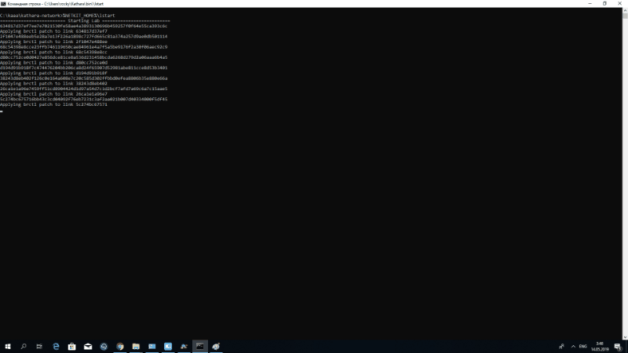
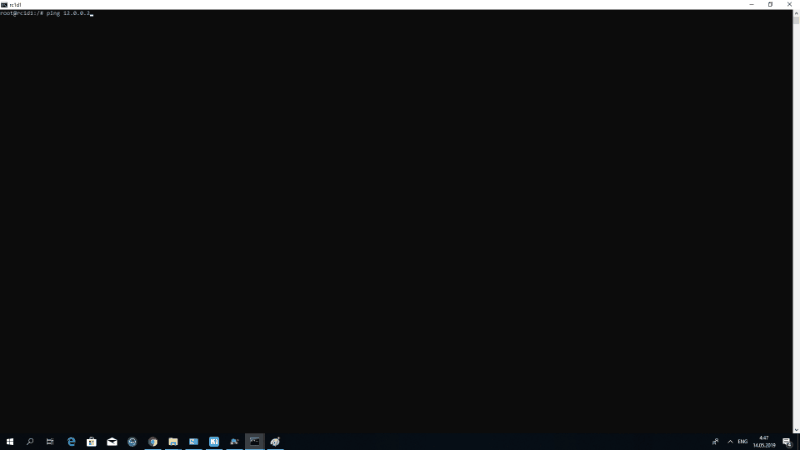

# Network with [Kathara](http://www.kathara.org/)
Basics of Grid and Cloud Computing. Part 2 course in SPbU:

The virtual network is built using Docker and Kathara. Apache is running on the server. 
When you close the connection from one of the routers, the users in this subnet lose the connection

Instruction:
1. In the folder with the laboratory Katara %NETKIT_HOME%\start
2. In server terminal "/etc/init.d/apache2 status"
(must be Apache is running)
3. In the same terminal "tail -f /var/log/apache2/access.log"
the log recording will start with all incoming calls to the server
4. In other terminals type "links 3.3.0.1"
the command opens the site page on the server

